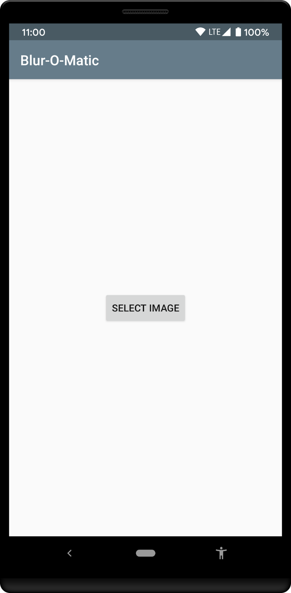
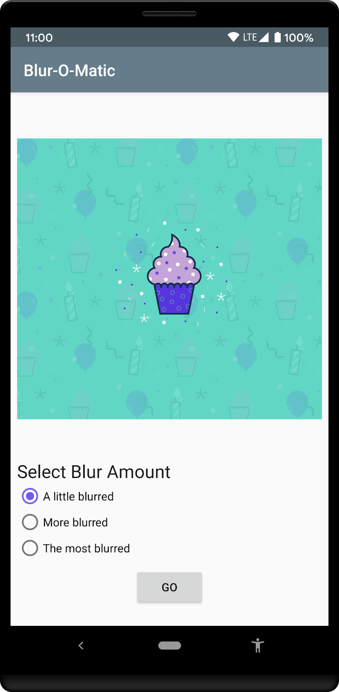

Blur O Matic App
===================================
Blur-O-Matic, an app that blurs photos and images and saves the result to a file.
App allows us to select your own image from the photos gallery to blur.

## Screenshots

WorkManager
===========

At I/O 2018 Google announced [Android Jetpack](https://developer.android.com//jetpack/),
a collection of libraries, tools and architectural guidance to accelerate and simplify the
development of great Android apps. One of those libraries is the
[WorkManager library](https://developer.android.com/topic/libraries/architecture/workmanager/).
The WorkManager library provides a unified API for deferrable one-off or recurring background tasks
that need guaranteed execution. You can learn more by reading the
[WorkManager Guide](https://developer.android.com/topic/libraries/architecture/workmanager/), the
[WorkManager Reference](https://developer.android.com/reference/androidx/work/package-summary)
or doing the
[WorkManager Codelab](https://codelabs.developers.google.com/codelabs/android-workmanager).

Pre-requisites
--------------

* Android Studio 3.6 or later and you know how to use it.

* Make sure Android Studio is updated, as well as your SDK and Gradle.
Otherwise, you may have to wait for a while until all the updates are done.

* A device or emulator that runs API level 16+

You need to be solidly familiar with the Kotlin programming language,
object-oriented design concepts, and Android Development Fundamentals.
In particular:

* Basic layouts, widgets and [View Bindings](https://d.android.com/topic/libraries/view-binding)
* Some familiarity with Uris and File I/O
* Familiarity with [LiveData](https://developer.android.com/topic/libraries/architecture/livedata)
  and [ViewModel](https://developer.android.com/topic/libraries/architecture/viewmodel)

Getting Started
---------------

1. [Install Android Studio](https://developer.android.com/studio/install.html),
if you don't already have it.
2. Download
2. Import into Android Studio.
3. Build and run the sample.